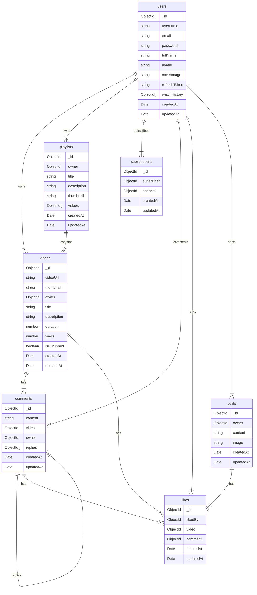

# ERD

> The following is the Entity Relationship Diagram for the database schema.

```mermaid
erDiagram
    users {
        ObjectId _id
        string username
        string email
        string password
        string fullName
        string avatar
        string coverImage
        string refreshToken
        ObjectId[] watchHistory
        Date createdAt
        Date updatedAt
    }

    videos {
        ObjectId _id
        string videoUrl
        string thumbnail
        ObjectId owner
        string title
        string description
        number duration
        number views
        boolean isPublished
        Date createdAt
        Date updatedAt
    }

    subscriptions {
        ObjectId _id
        ObjectId subscriber
        ObjectId channel
        Date createdAt
        Date updatedAt
    }

    playlists {
        ObjectId _id
        ObjectId owner
        string title
        string description
        string thumbnail
        ObjectId[] videos
        Date createdAt
        Date updatedAt
    }

    comments {
        ObjectId _id
        string content
        ObjectId video
        ObjectId owner
        ObjectId[] replies
        Date createdAt
        Date updatedAt
    }

    likes {
        ObjectId _id
        ObjectId likedBy
        ObjectId video
        ObjectId comment
        Date createdAt
        Date updatedAt
    }

    posts {
        ObjectId _id
        ObjectId owner
        string content
        string image
        Date createdAt
        Date updatedAt
    }

    users ||--|{ videos : "owns"
    playlists ||--|{ videos : "contains"
    users ||--|{ playlists : "owns"
    
    users ||--|{ subscriptions : "subscribes"

    users ||--|{ comments : "comments"
    videos ||--|{ comments : "has"
    comments ||--|{ comments : "replies"

    users ||--|{ likes : "likes"
    videos ||--|{ likes : "has"
    comments ||--|{ likes : "has"
    posts ||--|{ likes : "has"

    users ||--|{ posts : "posts"
```
